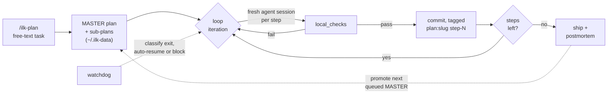

<div align="center">

# ilk-skills

**A staged execution loop for AI coding agents.**
Decompose work into a verifiable plan, then let the loop drive it to done —
across timeouts, API hiccups, and overnight runs.

[](LICENSE)
[](https://github.com/inluck-net/ilk-skills/actions/workflows/ci.yml)
[](#platform-support)
[](#platform-support)

</div>

> *ilk* — "of that kind". A kind of plan-loop: you decompose work into a
> sequenced **plan**, the loop drives a fresh AI session per step, and a
> watchdog keeps it going without human babysitting.

---

## Why this exists

A single agent session is a poor unit of work for anything real. It forgets, it
times out, it stops at the first ambiguity, and it will happily tell you it
finished something it never verified.

ilk-skills makes the **plan** the unit of work instead of the session:

- **Every step is recoverable from disk** — plans live as Markdown with
  frontmatter, so a run survives a killed session, a rebooted laptop, or a
  switch between Cursor, Claude Code, and Codex.
- **Every step has to prove itself** — each sub-plan step carries executable
  `local_checks`. "Done" means a command exited 0, not that a model said so.
- **Nothing runs unsupervised without a supervisor** — a watchdog classifies
  why a loop stopped and either resumes it or stops loudly with a reason.

## How it works



Plans, runtime state, and logs live under `~/.ilk-data/projects/<project-key>/`,
keyed off the project's `.git` root — **your repository never grows a single
skill artifact.**

## Quick start

> [!WARNING]
> **Installing changes your agent behavior globally — not just in this repo.**
>
> `conventions/config.yml` ships with `auto_use_ilk_plan: true`, and the normal
> `--apply` path always reconciles the auto-plan managed block. So `--apply`
> edits your **user-global agent instructions**, which apply to *every* project
> on the machine:
>
> | File | Effect |
> |---|---|
> | `~/.claude/CLAUDE.md` | Claude Code routes implementation work to `/ilk-plan` by default |
> | `~/.codex/AGENTS.md` | same routing for Codex |
> | `~/.cursor/rules/ilk-auto-plan.mdc` | same routing for Cursor |
>
> **`--dry-run` does not show this step** — it exits before the reconcile — so
> the dry-run output understates what `--apply` touches.
>
> **To install the skills without changing global agent behavior**, set
> `auto_use_ilk_plan: false` in `conventions/config.yml` before applying. The
> block is delimited by `<!-- ilk:auto-plan:start -->` / `<!-- ilk:auto-plan:end -->`
> markers, so it is fully removable — see [Auto-plan routing](#auto-plan-routing).

```bash
git clone https://github.com/inluck-net/ilk-skills.git
cd ilk-skills

# 1. Preview what would be linked (dry-run is the default for both installers)
./install.sh --dry-run           # Windows: ./install.ps1

# 2. Install
./install.sh --apply             # Windows: ./install.ps1 -Apply
```

The installer creates symlinks (junctions on Windows) into `~/.cursor/skills/`,
`~/.claude/skills/`, and `~/.codex/skills/`, plus the matching `commands/`
directories. Use `--only-codex` / `-OnlyCodex` to install for one host only.

The first install seeds `skills/ilk-launcher/projects.json` from
`projects.example.json` (the real file is gitignored, per-operator). Point it at
your projects, then from any git repo:

```bash
/ilk-plan "<describe the task>"   # writes a plan under ~/.ilk-data/...
/ilk                              # run the next pending step
/ilk-run                          # or: run unattended, with a watchdog
/ilk-status                       # read-only progress check
```

Codex users invoke the same skills through natural language — the installer
places identical files under `~/.codex/skills/`.

## Commands

| Command | What it does |
|---|---|
| `/ilk-plan` | Turn a free-text task into a MASTER plan + sub-plans with machine-checkable acceptance criteria |
| `/ilk` | Pick the active master and run the next pending step |
| `/ilk-run` | Start the loop *with* its watchdog, detached, for unattended runs |
| `/ilk-status` | Read-only progress. `--watch` gives a self-refreshing all-projects cockpit |
| `/ilk-schedule` | Launch the one cross-project scheduler that drains **every** project's queue |
| `/ilk-stop` | Stop a running loop and its watchdog |
| `/ilk-feedback` | Postmortem: classify why a run stopped, recommend next-launch params |
| `/ilk-upgrade` | Pull the latest toolkit and make it effective on this machine |
| `/ilk-spec` | Elaborate an under-specified task into a design spec before planning |
| `/ilk-resume` | Un-park a scheduler-blacklisted project |

## Skills

| Skill | Role |
|---|---|
| `ilk-loop` | The iterative engine: detached runner, per-step `local_checks`, `[plan:<slug>#step-N]` commit tagging, `last-exit.json` sentinel for IPC |
| `ilk-launcher` | Per-project launch / status / stop, plus single-project and cross-project dashboards |
| `ilk-watchdog` | Auto-resume layer. Reads the `last-exit.json` fast path, falls back to PID checks, advances the MASTER queue on a clean ship |
| `ilk-runner` | Orchestration layer sequencing launcher + watchdog for supervised runs |
| `ilk-feedback` | Postmortem classifier; reads recent iterations and emits a recommendation block |
| `ilk-spec` | Turns thin tasks into detailed specs when the missing detail is domain knowledge |
| `ilk-upgrade` | Updates the toolkit clone and relinks it |
| `ilk-lark-tickets` | Triage issue tickets stored in a Feishu (Lark) Bitable |
| `ilk-inbox-tickets` | Triage a cross-project Markdown handoff inbox |
| `ilk-self-improve` | Plan toolkit improvements from the feedback backlog |

## Key capabilities

- **Zero project pollution** — plans, runtime state, and logs live under
  `~/.ilk-data/projects/<project-key>/`, derived from the `.git` root.
- **Hybrid success/failure signals** — machine-executable `local_checks` per
  step, *plus* postmortem classification and watchdog auto-resume at the loop
  level.
- **Emergent FIFO master queue** — `MASTER-*.md` files sort by frontmatter
  `created` timestamp, with an optional `priority` override. The watchdog
  auto-promotes the next queued master when the active one ships.
- **Concurrent multi-worktree execution** — every `git worktree` resolves to its
  own `project_key`, so a feature loop and a hotfix loop run in parallel from
  one repo without seeing each other's plans, runtime, or PID files.
- **Meta-projects (polyrepo umbrellas)** — drop a `.ilk-meta.json` at a non-git
  parent containing sibling repos and ilk treats the umbrella as **one**
  project; each sub-plan declares `repo: <member>`. See
  [`skills/ilk-loop/references/meta-projects.md`](skills/ilk-loop/references/meta-projects.md).
- **Ambient observability** — `status_all.py` exposes all-projects state as
  JSON, feeding the `--watch` cockpit, an
  [xbar/SwiftBar menu-bar plugin](tools/xbar/README.md), and desktop
  notifications (`ILK_NOTIFY`). On macOS, where detached runs are headless
  `screen` sessions, `ILK_MULTIPLEXER=tmux` puts each scheduler slot in an
  attachable `ilk` tmux session. Additive and default-off.
- **Cross-machine sync via Git** — push on one machine, pull on the other,
  re-run the installer.

## Platform support

| Platform | Cursor | Claude Code | Codex | Installer |
|---|:---:|:---:|:---:|---|
| Windows 10 / 11 | ✅ | ✅ | ✅ | `install.ps1` — junctions for skills, copy-fallback for commands unless Developer Mode is on |
| macOS | ✅ | ✅ | ✅ | `install.sh` — full symlink set including bash entry points |
| Linux | ✅ | ✅ | ✅ | `install.sh` |

**Codex boundary.** All skills install and function under Codex. Planning
(`/ilk-plan`), single-step execution (`/ilk`), status, and postmortem work
identically across all three hosts. Detached autonomous runs (`/ilk-run` with
watchdog) currently rely on the Claude Code CLI runner
(`run_ilk_loop_claude.sh`); a dedicated Codex runner will close that gap.

## Requirements

| | |
|---|---|
| **bash** | macOS ships 3.2 (ancient but sufficient); any modern Linux is fine |
| **Python 3** | used by `loop_status.py`, `status_all.py`, and other helpers (stdlib only) |
| **`gtimeout`** *(macOS)* | the bash runner uses GNU timeout for iteration time-boxing — `brew install coreutils` |
| **`jq`** *(recommended)* | preferred for JSON parsing; falls back to a Python one-liner |

## Upgrading

The easiest path is `/ilk-upgrade`, which pulls and relinks in one step:

```bash
# macOS / Linux — <skill-root> is ~/.claude/skills, ~/.cursor/skills, or ~/.codex/skills
bash "<skill-root>/ilk-upgrade/scripts/upgrade.sh" --check    # read-only
bash "<skill-root>/ilk-upgrade/scripts/upgrade.sh" --apply
```

```powershell
# Windows
powershell -NoProfile -ExecutionPolicy Bypass -File `
    "<skill-root>\ilk-upgrade\scripts\upgrade.ps1" -Apply
```

`--check` fetches and reports ahead/behind counts. `--apply` pulls with
`--ff-only` and re-runs the installer when needed; if a live loop is running it
refuses unless you pass `--force`. Manual equivalent: `git pull --ff-only &&
./install.sh --apply`.

## Auto-plan routing

Installs a routing rule into each host's user-global instructions so new
sessions default to routing implementation work through `/ilk-plan` instead of
implementing directly. It manages three user-global files:

| Host | File | Type |
|---|---|---|
| Claude Code | `~/.claude/CLAUDE.md` | delimited managed block |
| Codex | `~/.codex/AGENTS.md` | delimited managed block |
| Cursor | `~/.cursor/rules/ilk-auto-plan.mdc` | dedicated owned file |

```bash
# Enable
./install.sh --auto-use-ilk-plan --apply       # Windows: -AutoUseIlkPlan -Apply

# Disable — set auto_use_ilk_plan: false in conventions/config.yml, then:
./install.sh --only-auto-plan --apply          # Windows: -OnlyAutoPlan -Apply
```

**Cross-machine propagation:** commit `conventions/config.yml`, push, then run
`/ilk-upgrade --apply` on each machine — the upgrade reconciles the block after
every successful pull. The heuristic itself lives in
[`conventions/auto-plan-routing.md`](conventions/auto-plan-routing.md).

## Building on top of ilk

If you're building an *external* tool that observes or controls the loop — a
dashboard, a bot, a mobile remote — start with
[`docs/integration-surface.md`](docs/integration-surface.md). It documents the
status CLIs and their `--json` schemas, the `~/.ilk-data/` layout, the plan-file
contract, and the verification gates.

ilk exposes no HTTP API or auth layer by design, and the loop is
**plan-file-driven with no mid-iteration steering** — so a controller is a thin
shim over these CLIs and files plus whatever transport and auth you add.

## Repo layout

```
skills/           per-skill SKILL.md + scripts
commands/         slash command bodies for Cursor, Claude Code, Codex (ilk*.md)
conventions/      cross-host conventions + the auto_use_ilk_plan switch
tools/            standalone utilities (claude-worker, tray, xbar)
tests/            repo-level shell tests (per-skill tests live in skills/*/tests)
docs/             design notes and field evidence from real runs
docs/standards/   external standards this repo follows + compliance table
install.sh        macOS / Linux installer
install.ps1       Windows installer
```

## Documentation

| Document | Contents |
|---|---|
| [CONTRIBUTING.md](CONTRIBUTING.md) | Dev setup, running the tests, the self-modification hazard |
| [SECURITY.md](SECURITY.md) | Reporting, and what this toolkit does to your machine |
| [CHANGELOG.md](CHANGELOG.md) | Release highlights |
| [`docs/integration-surface.md`](docs/integration-surface.md) | The consumer-facing surface for external tools |
| [`docs/standards/`](docs/standards/agentskills-io.md) | agentskills.io references and per-skill compliance |

## Contributing

Issues and pull requests are welcome — see [CONTRIBUTING.md](CONTRIBUTING.md).
Two things worth knowing before you start: installed skills are **symlinks into
your clone**, so editing this repo changes live agent behavior; and the test
suite has environment-dependent tests that fail outside a fully installed
layout. Both are documented there.

## License

[Apache License 2.0](LICENSE).
