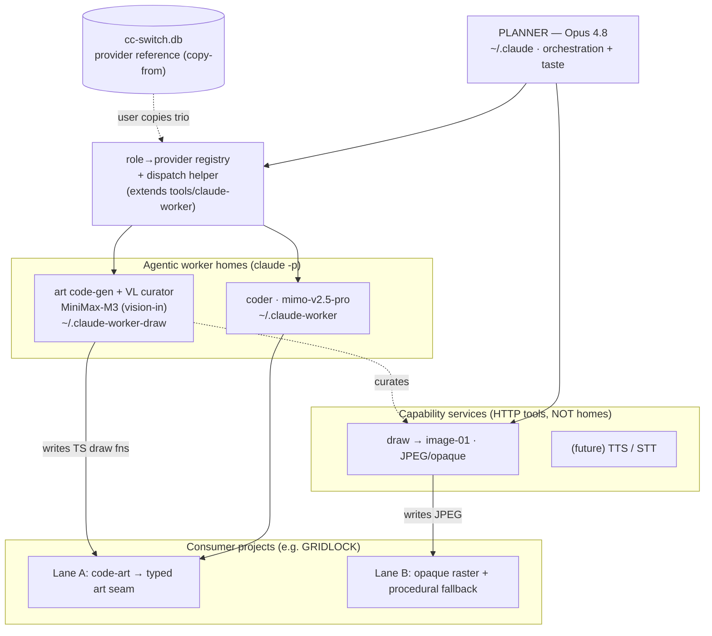

# Model / Worker Framework

> **Status:** shipped — extends [`dual-claude-homes-design.md`](dual-claude-homes-design.md)
> from two roles (planner + worker) to **N roles + capability services**.
> **Last updated:** 2026-06-28.
> **Driving request:** GRIDLOCK needs a "drawing worker" to upgrade its UI —
> see `gridlock/docs/handoffs/2026-06-28-drawing-worker-handoff.md` (incl. the
> §1.5 MiniMax-M3 capability probe results). GRIDLOCK is a *consumer* of this
> toolkit; its handoff is the requirements input, the deliverable lands here.

---

## 0. Relationship to dual-claude-homes-design

The dual-homes design established the foundation this builds on — read it first:

- **Home isolation** via `CLAUDE_CONFIG_DIR` (`~/.claude` planner, `~/.claude-worker`
  worker); skills/commands linked per-home by `install.{sh,ps1} --claude-home`.
- **Provider pinning** in each home's `settings.json` `env` block
  (`ANTHROPIC_BASE_URL`+`ANTHROPIC_AUTH_TOKEN`+`ANTHROPIC_MODEL`); wrapper
  **fails closed** if any is missing.
- **Secrets rule:** tooling must **NOT** auto-extract from `~/.cc-switch/cc-switch.db`;
  the user supplies/copies provider values. cc-switch is a *reference*, not a
  runtime secret source. (See §5 — this constrains the registry design.)
- **MCP isolation:** worker reads its OWN `~/.claude-worker/.claude.json`; add MCPs
  with `tools/claude-worker/ilk-worker-mcp` (copies only that server's OAuth,
  never `claudeAiOauth`). Probe the worker surface with
  `skills/ilk-loop/scripts/worker_mcp.py list`.

This document adds: (a) **more than one worker role**, selected by a registry;
(b) a **capability-services layer** (image/TTS/STT) that is explicitly *not* a
worker home.

## 1. Two kinds of "model role" (the core distinction)

1. **Agentic worker homes** — chat/coding/vision models run as `claude -p`
   subprocesses; each needs an isolated home (`CLAUDE_CONFIG_DIR`) carrying the
   coupled provider trio. The model name is **not** swappable alone — host +
   token move with it (it's a provider profile, the unit cc-switch manages).
2. **Capability services** — plain HTTP endpoints (image gen, TTS, STT). **Not**
   worker homes, no `CLAUDE_CONFIG_DIR`. Wrapped as MCP/CLI tools a worker or the
   planner calls. New capabilities are added here, **never** as new homes.

> Rule of thumb: *reasons agentically + calls tools?* → worker home.
> *Single request→response transform (pixels/audio/text)?* → capability service.

## 2. Component list

### 2a. Agentic worker homes

| Role | Model | cc-switch provider | Host | Home | Vision? | Status |
|---|---|---|---|---|---|---|
| **planner** | Opus 4.8 | Claude Official | api.anthropic.com | `~/.claude` | — | shipped (dual-homes) |
| **coder** | `mimo-v2.5-pro` | Xiaomi MiMo V2.5 - Pro | token-plan-cn.xiaomimimo.com | `~/.claude-worker` | no | shipped (dual-homes) |
| **art code-gen** | `MiniMax-M3` | MiniMax | api.minimaxi.com | `~/.claude-worker-draw` | **yes (input)** | **shipped** |
| **VL curator** | `MiniMax-M3` | MiniMax | api.minimaxi.com | `~/.claude-worker-draw` (shared) | **yes (input)** | **shipped** |
| _(fallback curator)_ | `mimo-v2.5` | Xiaomi MiMo V2.5 | token-plan-cn.xiaomimimo.com | _(opt.)_ | yes | optional |

> art code-gen and VL curator are the **same M3 home** — only the prompt differs.
> Don't split into separate homes unless they later need distinct MCP toolsets or
> true parallelism. (Existing `~/.claude-worker-1`/`-2` homes are the best-of-N
> pattern from dual-homes §"Best-Of-N", a separate concern.)

### 2b. Capability services (HTTP tools, not homes)

| Capability | Endpoint | Model id | Auth | I/O | Status |
|---|---|---|---|---|---|
| **image gen** | `POST api.minimaxi.com/v1/image_generation` | `image-01` | `Bearer` (MiniMax CN token) | prompt+aspect_ratio → base64 **JPEG** (no alpha) | **shipped** (`tools/minimax/draw.py gen`) |
| _TTS_ | MiniMax T2A (`/v1/t2a_*`) | tbd | same account | text → audio | future |
| _STT_ | MiniMax ASR | tbd | same account | audio → text | future |

> **image-01 caveat (probe-verified 2026-06-28):** JPEG only ⇒ **opaque, no
> transparency**; `aspect_ratio` not pixel W×H; ~17.5s latency. Good for opaque
> static art (backgrounds, key-art, splashes); **not** transparent sprites —
> those stay code-art. Same CN token/host serves both M3 chat and image-01.

### 2c. Supporting components

| Component | Role | Location |
|---|---|---|
| **cc-switch DB** | reference for provider values (user copies from) | `~/.cc-switch/cc-switch.db` |
| **role→provider registry** | maps role → provider profile; provisions homes | _to build_ (extends `tools/claude-worker/`) |
| **dispatch helper** | given a role, launch `CLAUDE_CONFIG_DIR=<home> claude -p` | **shipped** (launcher `-WorkerHome` override + `CLAUDE_WORKER_HOME` env) |
| **`worker_mcp.py list`** | probe a worker home's MCP surface | `skills/ilk-loop/scripts/` (exists) |
| **`ilk-worker-mcp`** | add an MCP to a worker home safely | `tools/claude-worker/` (exists) |

## 3. Architecture graph

## 4. How to extend (keep this doc current)

- **Add an agentic role:** add the provider to cc-switch (for the user to copy
  from), add a §2a row, add a registry entry (role→provider). Provision a home
  via the bootstrap path. New home only when the role needs a distinct MCP set
  or concurrency (avoids `.claude.json` races — dual-homes "Critical gotcha").
- **Add a capability:** add a §2b row + wrap the endpoint as one MCP/CLI tool.
  **Never** a worker home for a request→response service.
- After any change: update §2 tables + §3 graph, bump "Last updated".

## 5. Design decisions (resolved)

1. **cc-switch secret handling.** Resolved: the sanctioned path is
   `ccswitch_import.py export --provider MiniMax --machine` (read-only export
   of the raw token for piping into bootstrap or the `draw` tool). The
   bootstrap writes it into the home's `settings.json` `env` block; the `draw`
   tool imports `ccswitch_import` at runtime to load credentials. Neither
   path ever prints, logs, or commits the token. No auto-extraction from
   `cc-switch.db` — the `ccswitch_import.py` helper is the explicit,
   user-approved read path. (Shipped in sub-plans 1 + 2.)
2. **Registry format + home location.** The named home
   `~/.claude-worker-draw` is provisioned via the existing `bootstrap --home`
   flag (already existed; tested with MiniMax-like values in sub-plan 2).
   Dispatch uses the launcher's `-WorkerHome ~/.claude-worker-draw` override
   (also pre-existing). A formal role→provider registry file is deferred —
   the current implicit mapping (bootstrap command → home) is sufficient for
   the three roles shipped.
3. **Self-hosting safety.** This batch was run `supervised_only: true` per the
   MASTER. All changes are additive (new `tools/minimax/`, bootstrap test
   coverage, docs) and touch no loop infrastructure.

   > ⚠️ Historical record — **do not copy this as precedent.** "Additive and
   > touches no loop infrastructure" is precisely the case where
   > `supervised_only` is *unwarranted* (decomposition-principles.md §13); the
   > flag's only trigger is `scope_paths` modifying loop infra.
   > `plan_lint.py --master` now reports this combination as a hard finding.

## 6. Verification discipline

- **Lane A code-art:** consumer-side gates (`tsc`/`eslint`/`vitest`/`build` +
  browser boot-smoke where the worker has `chrome-devtools`). Visual taste = human.
- **Lane B raster:** M3 VL curator judges style/dims/usability → reject+regen;
  every asset has a procedural fallback so a missing/failed asset never breaks
  the consumer.
- **Cost/role discipline** (decomposition-principles §20): orchestration + taste
  = planner (Opus); bulk drawing-code = M3; bulk impl = mimo-pro; visual judgment
  = M3 VL. Don't do grunt work on Opus.
